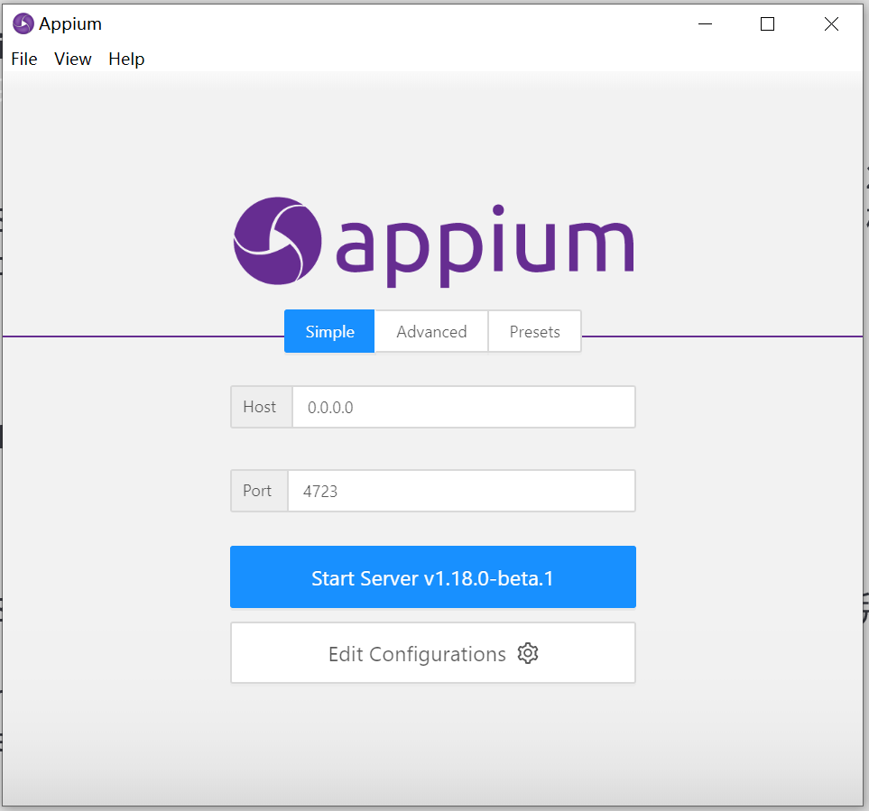
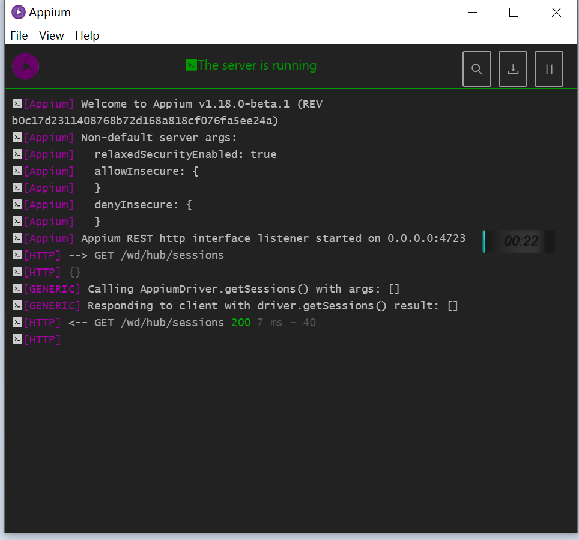
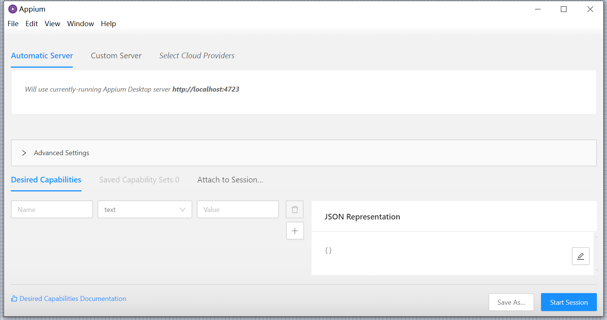
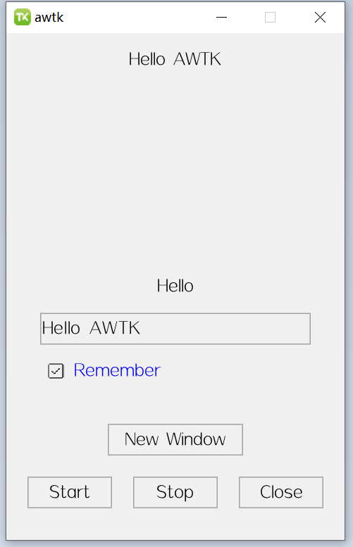
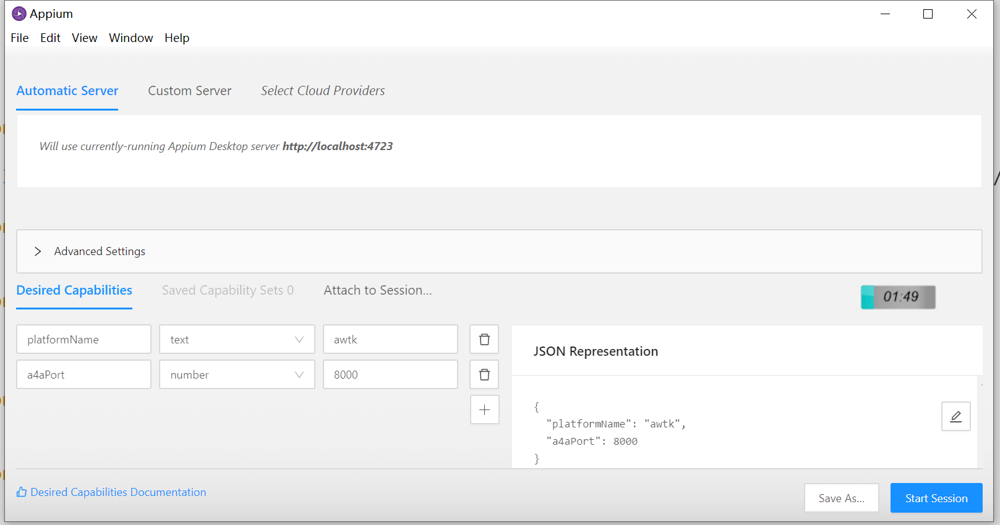

# 安装支持 AWTK 自动测试的 appium

> 本文是在 Windows 下的 git bash 中运行的，其它环境请自行调整。

## 0. 安装 nodejs

appium 是用 nodejs 开发的，需要安装 [nodejs](https://nodejs.org/en/)，并设置好路径。

## 1. 安装 appium desktop

### 1.1 下载

Windows 版本可以下载这个：[Appium-windows-1.18.0](https://github.com/appium/appium-desktop/releases/download/v1.18.0-1/Appium-windows-1.18.0-1.zip)

### 1.2 解压

```
 mkdir appium-desktop/
 cd appium-desktop/
 unzip ~/Downloads/Appium-windows-1.18.0-1.zip
 ```

### 1.3 替换缺省的 appium

由于 appium 不支持动态扩展，我只好修改了它的代码。所以需要用修改之后的版本代替内置的版本。

```
cd resources/app/node_modules

mv appium appium.org
git clone https://hub.fastgit.org/zlgopen/appium
cd appium
npm install
npm run build
cd ../../../../
```

> npm install 出现错误，可以不用管它。

## 2. 启动 Appium-desktop

运行 Appium.exe 命令：

```
./Appium.exe
```

* 启动成功后会看到下面的界面：



* 用缺省参数启动 appium 服务，启动成功后会看到下面的界面：



## 3. 启动 inspector

> 此步可选，不需要的童鞋请跳过。

* 点击上图的  按钮，可以启动 appium inspector，成功后可以看到下面的界面：



* 启动一个支持自动测试的 AWTK 应用程序，如 awtk-ui-automation 中的 demo

```
awtk-ui-automation
./bin/demo
```

界面效果如下：



* 回到 appium-inspector, 输入下面的参数

```json
{
  "platformName": "awtk",
  "a4aPort": 8000
}
```



* 然后点击"Start Session"，成功后可以看到下面的界面：


